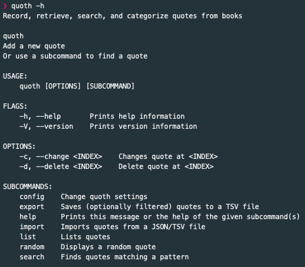
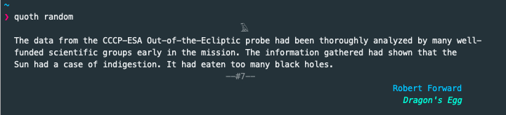

# quoth

### a command-line tool to record, retrieve, search, and categorize quotes from books

A Rust learning project. 

This [blog post](https://out-of-cheese-error.netlify.app/quoth) has more details.

### Usage:

### Examples:

Adding a new quote:

Searching for a quote (shell completions generated using `quoth config --completions zsh > ~/.oh_my_zsh/completions/_quoth`):

Random quote:

[Quoth the Raven](https://wiki.lspace.org/mediawiki/Quoth)
